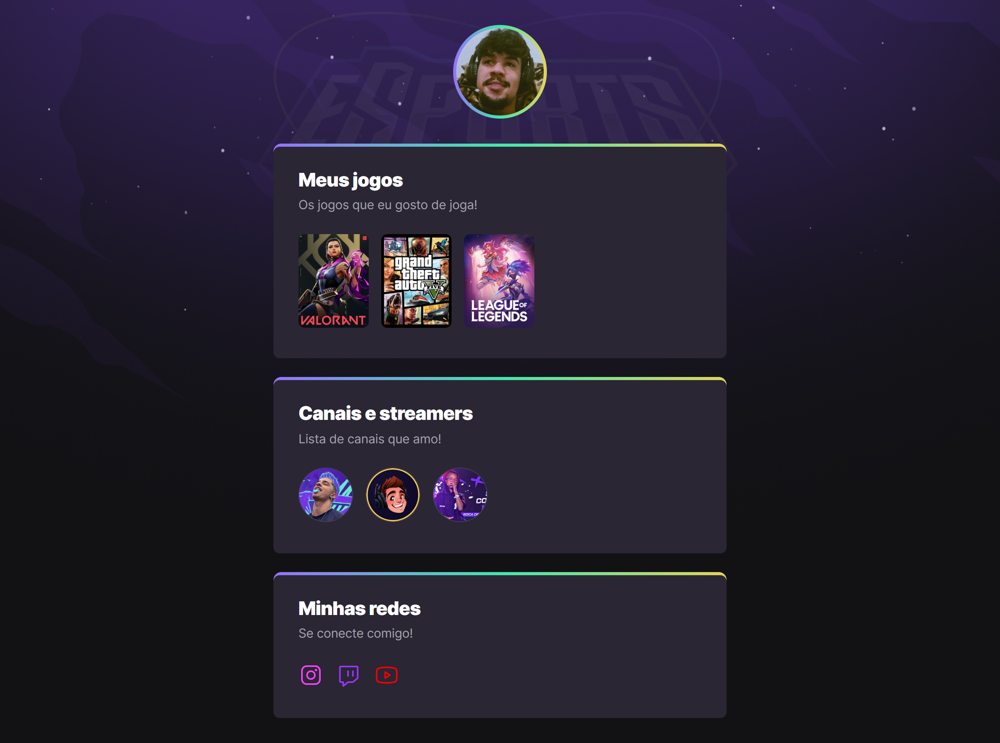

# NLW eSport

> trilha explorer

Projeto construído na Next Level Week da Rocketseat.

[🔗 Clique aqui para acessar](https://import-willian.github.io/nlw-esport-explorer/    )

## tecnologias

 
    
    
    
          

